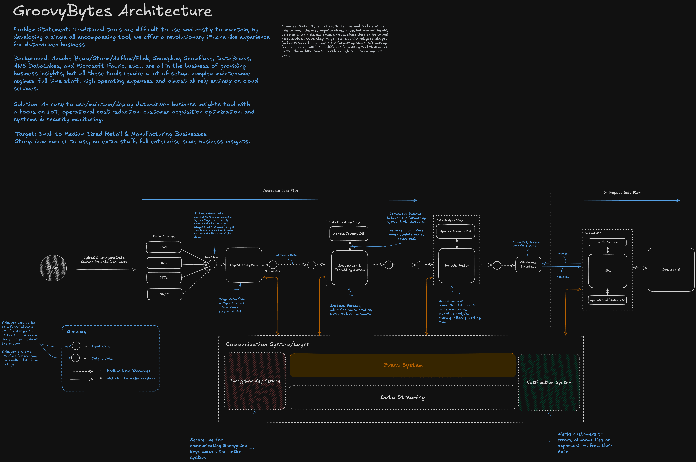

# GroovyBytes 

GroovyBytes is a business insights platform that enables users to easily ingest, analyze, and visualize data from various sources. The platform is designed to be easy to use and able to handle structured, semi-structured, and unstructured data formats efficiently.

The platform consists of several systems that work together to provide a seamless data processing pipeline. These systems include:
- **Ingestion System**: Responsible for ingesting data from various sources.
- **Formatting System**: Handles data formatting and sanitization.
- **Analysis System**: Analyzes the data and generates insights.
- **Events System**: Manages event streams and notifications.

The platform also includes a user-facing dashboard built with Astro, a modern static site generator for building websites.



## Project Setup

To set up the project locally, follow the steps below:

### Prerequisites:

DevBox is a tool that provides a consistent development environment for the project. It is recommended to use DevBox to set up the project locally. To install DevBox, run the following commands:

```sh
curl -fsSL https://get.jetify.com/devbox | bash
devbox shell
```

Or, you can install the required tools manually.

Ensure you have the following installed:
- [Node.js](https://nodejs.org/) (version specified in `.nvmrc`)
- [pnpm](https://pnpm.io/installation)
- [python](https://www.python.org/)
- [Docker](https://docs.docker.com/get-docker/)

## Project Structure

The project is organized into several directories, each serving a specific purpose:

```md
📦apps
 ┣ 📂dashboard
 ┃ ┣ 📜astro.config.ts
 ┃ ┣ 📜components.json
 ┃ ┗ 📂src
 ┃   ┣ 📂components
 ┃   ┃ ┗ 📜FileUploader.tsx
 ┃   ┣ 📂layouts
 ┃   ┃ ┗ 📜Layout.astro
 ┃   ┣ 📂pages
 ┃   ┃ ┣ 📂api
 ┃   ┃ ┃ ┗ 📜upload.ts
 ┃   ┃ ┗ 📜index.astro
 ┃   ┣ 📂public
 ┃   ┃ ┗ 📜favicon.svg
 ┃   ┣ 📜README.md
 ┃   ┣ 📜package.json
 ┃   ┗ 📜tsconfig.json

📦packages
 ┣ 📂schema
 ┃ ┣ 📂src
 ┃ ┃ ┣ 📜index.ts
 ┃ ┃ ┣ 📜example.ts
 ┃ ┃ ┣ 📜schema.ts
 ┃ ┃ ┗ 📜utils.ts
 ┃ ┣ 📜README.md
 ┃ ┣ 📜package.json
 ┣ 📂sinks
 ┃ ┣ 📂src
 ┃ ┃ ┣ 📂input
 ┃ ┃ ┃ ┣ 📜input.ts
 ┃ ┃ ┣ 📂output
 ┃ ┃ ┃ ┣ 📜output.ts
 ┃ ┃ ┣ 📜ctx.ts
 ┃ ┃ ┣ 📜index.ts
 ┃ ┣ 📜README.md
 ┃ ┣ 📜package.json

📦systems
 ┣ 📂analysis
 ┣ 📂events
 ┃ ┣ 📜README.md
 ┃ ┣ 📜bkvm.conf
 ┃ ┣ 📜docker-compose.yml
 ┃ ┣ 📜package.json
 ┃ ┗ 📜setup-pulsar.sh
 ┣ 📂formatting
 ┗ 📂ingestion
 
📜README.md
📜tsconfig.json
📜tsup.config.ts
```

### Explanation of the Project Structure

- **apps/**: Contains user-facing applications. Currently, it includes the Astro demo dashboard.
  - **dashboard/**: The Astro demo dashboard application.
    - **src/**: Source code for the dashboard.
    - **public/**: Static assets like images for the dashboard.
- **packages/**: Contains shared packages used across the platform.
  - **schema/**: Defines schemas for data validation and transformation.
  - **sinks/**: Manages connections to data sinks to/from Pulsar.
- **systems/**: Contains various systems used by GroovyBytes.
  - **analysis/**: Analysis System.
  - **events/**: Event system configuration and scripts (basically just Pulsar).
  - **formatting/**: System for data formatting.
  - **ingestion/**: System for data ingestion.
- **devbox.json**: Configuration file for DevBox.
- **pnpm-workspace.yaml**: Configuration file for pnpm workspace.
- **package.json**: Root package.json file for the project.
- **tsconfig.json**: TypeScript configuration file.
- **tsup.config.ts**: Configuration file for tsup, a TypeScript bundler.

> **Note**: The project structure is subject to change as the project evolves. In addition, I've excluded files and directories that are not relevant to the project setup.

## Steps to Deploy:

1. **Run Pulsar Setup**: Use the following command to start Pulsar:
   ```sh
   bash systems/events/setup-pulsar.sh
   ```

3. **Initialize Superuser**: After the containers are running, initialize the superuser using the following commands:
   ```sh
   CSRF_TOKEN=$(curl http://localhost:7750/pulsar-manager/csrf-token)
   curl -H "X-XSRF-TOKEN: $CSRF_TOKEN" \
        -H "Cookie: XSRF-TOKEN=$CSRF_TOKEN;" \
        -H "Content-Type: application/json" \
        -X PUT http://localhost:7750/pulsar-manager/users/superuser \
        -d '{"name": "admin", "password": "apachepulsar", "description": "test", "email": "username@test.org"}'
   ```

You can then access the Pulsar Manager web UI at `http://localhost:9527` using the default credentials:  
- **Username**: `admin`  
- **Password**: `apachepulsar`

This configuration ensures all required ports are mapped and the containers are linked for intercommunication.

To learn more about the event system, refer to the [Events System README](systems/events/README.md).

### Running the Dashboard

To start the Astro demo dashboard:

```sh
pnpm --filter dashboard dev
```

### Handling Data Source Formats

To handle various **data source formats** effectively within the Pulsar messaging system, we need to integrate the data format characteristics into the **message schema**, **topic structure**, and **Pulsar client configurations**. Here’s how you can incorporate different data formats:

#### Key Data Formats to Address

1. **Structured Data**: SQL/NoSQL databases.
2. **Semi-Structured Data**: JSON, XML, YAML, CSV.
3. **Unstructured Data**: Files (images, videos, text).
4. **Streaming Data**: MQTT, WebSockets, or other brokers.
5. **Data Transfer Protocols**: HTTP, FTP, etc.

#### Incorporating Data Formats into Pulsar

**a. Use Message Properties**

- Pulsar supports **message properties**, which are key-value pairs stored alongside the message payload.
- Include metadata in properties for each message to describe the source, format, and other details.

**Example Properties**:

- `format`: `json`, `csv`, `xml`, `binary`.
- `sourceType`: `sql`, `nosql`, `filesystem`, `mqtt`.
- `sourceId`: Unique identifier for the data source.
- `compression`: `gzip`, `snappy`, etc. (if payloads are compressed).

**b. Design Topic Subscriptions by Format**

- To simplify consumer logic, create sub-topics or subscriptions based on data formats.
- For example:
  - `public/ingestion/input.json`
  - `public/ingestion/input.xml`

The official format for topics with Pulsar producer and consumer is `persistent://tenant/namespace/topic`.

- `tenant` is the tenant name, e.g. `public`.
- `namespace` is the namespace name, e.g. `ingestion`.
- `topic` is the topic name, e.g. `input.json`.

### Updated Namespaces/Topics with Data Formats

| **Namespace**   | **Topic**    | **Partitions** | **Purpose**                           | **Format** |
| --------------- | ------------ | -------------- | ------------------------------------- | ---------- |
| `ingestion`     | `input.json` | 3              | Receives JSON data.                   | JSON       |
| `ingestion`     | `input.csv`  | 3              | Receives CSV data.                    | CSV        |
| `ingestion`     | `input.xml`  | 3              | Receives XML data.                    | XML        |
| `ingestion`     | `input.text` | 3              | Receives text data.                   | Text       |
| `ingestion`     | `output`     | 3              | Sends merged data streams onward.     | Mixed      |
| `formatting`    | `input`      | 3              | Receives data for sanitization.       | Mixed      |
| `formatting`    | `output`     | 3              | Sends formatted data to analysis.     | Mixed      |
| `analysis`      | `input`      | 3              | Receives formatted data.              | Mixed      |
| `analysis`      | `output`     | 3              | Sends analysis results to dashboard.  | Mixed      |
| `logging`       | `system`     | 1              | Logs system-wide operations.          | Logs       |
| `notifications` | `alerts`     | 1              | Sends alerts to notification systems. | Alerts     |
| `errors`        | `system`     | 1              | Captures system error messages.       | Errors     |

The reason why we have multiple partitions is to allow for parallel processing of messages. Each partition can be consumed by a separate consumer, enabling horizontal scaling.

The reason we have separate topics for different data formats is to simplify the processing logic. Consumers can subscribe to topics based on the format they support, making the system more modular and extensible. And we can parallelize the processing of different data formats in input sinks.

### Message Schema for Data Formats

The message schema is located at [packages/schema/src/schema.ts](packages/schema/src/schema.ts)

```ts
// Example message for a JSON payload
const jsonMessage = {
  "header": {
    "messageId": "123e4567-e89b-12d3-a456-426614174000", // Unique identifier for the message
    "source": "service-a", // The system or service sending the message
    "destination": "persisted://public/ingestion/input.json", // The system or service intended to receive the message (right now you have to manually specify the topic but long term we can automate this)
    "timestamp": 1700123456789, // Timestamp in Unix epoch format (milliseconds since 1970)
    "type": "data", // The type of message, validated by MessageTypeSchema (e.g., data, status, event, or log)
    "protocolVersion": "1.0" // Version of the protocol for compatibility between systems
  },
  "payload": {
    "data": {
      "key0": ["value0", 45], // Example key-value pair for structured JSON data
      "values": { 
        "key1": "value1", // Example key-value pair for structured JSON data
        "key2": 42, // Another example showing numeric values
        "key3": true // Boolean values can also be part of the JSON payload
      }
    }
  },
  "meta": {
    "traceIds": ["trace-123", "trace-456"], // Trace IDs for tracking the message flow through systems
    "fileName": "example.csv", // (Optional) Name of the file related to this message
    "fileType": "text/csv", // (Optional) MIME type of the file
    "fileSize": 1024, // (Optional) Size of the file in bytes
    "chunkId": 1, // (Optional) Current chunk ID if the file is split into parts
    "chunkSize": 512, // (Optional) Size of each chunk in bytes
    "totalChunks": 2, // (Optional) Total number of chunks for the file
    "ttl": 60000, // (Optional) Time-to-live in milliseconds for the message
    "expiryTimestamp": 1700123516789, // (Optional) Expiry timestamp in Unix epoch format
    "data": {
      "format": "json", // Data format used for the source (e.g., json, csv, etc.)
      "sourceType": "sql", // Source type (e.g., sql, nosql, filesystem, etc.)
      "sourceId": "database-1", // (Optional) Unique identifier for the source
      "compression": "gzip", // (Optional) Compression type if applicable
      "encryption": "aes-256", // (Optional) Encryption type if applicable
      "checksum": "sha256" // (Optional) Checksum type for verifying data integrity
    },
    "retry": {
      "maxRetries": 3, // Maximum number of retries allowed for processing
      "remainingRetries": 2 // Number of retries still available
    },
    "errorDetails": {
      "lastError": "Connection timeout", // Description of the last encountered error
      "lastErrorTimestamp": 1700123400000 // Timestamp of the last error in Unix epoch format
    },
    "throughput": 100, // (Optional) Data throughput in KB/sec for monitoring performance
    "latency": 50, // (Optional) Latency in milliseconds for message delivery
    "priority": "high" // (Optional) Priority level of the message (e.g., low, normal, high, critical)
  }
};
```

